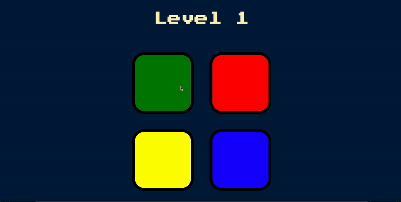

# Javascript Simon

Javascript version of the classic 1980's memory game Simon.

<strong>Simon</strong> is an electronic memory game where the device creates a series of tones and lights and requires a user the repeat the sequence. If the user succeeds, the series becomes progressively longer and more complex. Once the user fails by repeating the sequence out of order, the game ends. 

## Gif Of Usage

## Installation and Setup Instructions

Clone down this repository. You only need to open the html file in a browser.

## Reflection

- Through this project I learned about about DOM manipulation and jQuery.
- The stack used here is rather simple, HTML, CSS, Javascript, and jQuery.
